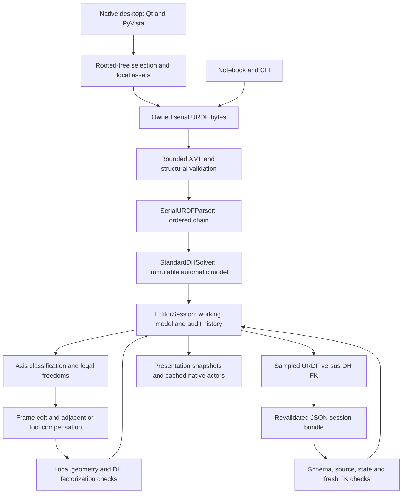

# Architecture and editing contract

This is the current implementation contract through Stage 20. Earlier stage notes
are historical records, including interfaces that later stages extended.
The native Qt application is the end-user interface; Jupyter and the CLI provide
research workflows. The standalone Windows distribution remains future work.

## Data ownership and boundaries

`URDFInput` owns the exact XML bytes and SHA-256 digest. Structural validation
precedes parsing; adapters must preserve source identity, endpoints and ordered
joints. Fixed joints contribute transforms without DH rows. Supported moving
joints are revolute, continuous and prismatic. A whole rooted tree is selectable
in the desktop, but only one selected serial path enters the DH pipeline. This
is not simultaneous branched-robot kinematics or closed-chain support.

`AutomaticDHResult` retains the validated source, chain, baseline and effective
configuration. `EditorSession` owns immutable baseline and working snapshots,
frame statuses, one pending proposal, and ordered events. Optional UI dependencies
are loaded at presentation boundaries; the parser, solver and session are usable
headlessly. Robot dimensions come from the source, not UR5 constants.

The transform convention is Standard DH:

`A_i(q) = Rz(theta_i(q)) Tz(d_i(q)) Tx(a_i) Rx(alpha_i)`.

The complete model includes base and tool transforms. Revolute/continuous joints
vary theta; prismatic joints vary d, preserving the stored joint sign and zero
offset. Dropping the base/tool alignment or treating the table as Modified DH
changes the model. Joint pose sliders change q only; DH controls change the frame
convention with compensation.

## Geometric cases and legal continuous edits

For normalized directions u and v, parallelism uses `||u cross v||`. Nonparallel
line distance uses the absolute projection of the anchor separation on their
normalized cross product. Near-parallel separation uses the maximum transverse
anchor separation against the two directions, avoiding unstable remote closest
points. Equality belongs to the parallel/intersecting side of each threshold.

| Axis relation | Controls when no review lock applies | Units |
|---|---|---|
| Parallel, distinct (including antiparallel directions) | Translation along current z | m |
| Coincident parallel axes | Translation along z and rotation about z | m, rad |
| Intersecting nonparallel axes | No continuous freedom; confirm the frame | — |
| Skew axes | No continuous freedom; confirm the frame | — |
| Tolerance-classified relation requiring review | No nonzero edit permitted | — |

These freedoms preserve directed z axes; arbitrary six-axis dragging and discrete
x-axis flips are unsupported. The final axis pair includes a synthetic terminal
solver convention, not an extra physical joint. Classification is recalculated
from the current model. A category alone does not grant permission: approximate
parallelism, coincidence or intersection can set `requires_review`, withholding
continuous controls until the geometry is resolved.

For a permitted edit, the selected world frame becomes
`T_i' = T_i Tz(delta) Rz(phi)`. The solver refactors its row and the following row
so other world frames remain fixed at zero pose. At the last frame it compensates
the tool transform instead. Refactorization preserves joint metadata and signs.
Global FK then checks the resulting moving model against the URDF.

## Local validation and the R1–R3 reference gap

The implementation does **not** claim a verified mapping to the external report's
R1–R3 numbering. That report reconciliation remains pending. The implemented
conditions and their actual diagnostic identifiers are:

| Condition | Diagnostic | Implementation |
|---|---|---|
| Finite rigid homogeneous frame with orthonormal, right-handed rotation | `rigid_frame` | Transform value validation |
| Preserve the directed joint-axis line | `joint_axis` | z-direction difference and transverse origin displacement |
| Candidate x perpendicular to preceding z; rigidity supplies perpendicularity to its own z | `common_normal` | Dot-product check |
| Relative transform reconstructible by a Standard-DH row | `dh_factorization` | Extract row, rebuild transform, compare elements |
| Nonzero controls authorized by current classification | `edit_space` | Check before recomputation |

See [recomputation implementation](../urdf2dt/dh/recompute.py) and
[classification implementation](../urdf2dt/dh/classification.py).
These checks explain the implemented geometry without inventing report labels.
Local acceptance is not global FK certification.

## Session transition rules

| Action | Preconditions | Result |
|---|---|---|
| New session | Valid baseline | F1 editable, successors locked |
| Unlock next | No pending proposal | First unaccepted frame becomes editable |
| Propose | Predecessors accepted; target editable or accepted | Pending candidate, committed model unchanged |
| Accept unchanged | Valid pending proposal | Target accepted; next locked frame can open |
| Accept changed | Local validation succeeds | Compensated model commits atomically; successors invalidated |
| Reject | Pending proposal | Committed geometry/status preserved; rejection recorded |
| Restore frame | No pending proposal; target accessible | Baseline frame restored with compensation; acceptance withdrawn |
| Restore automatic | No validator reentry | Exact baseline and initial statuses restored; audit retained |
| Validate or export | All frames accepted, no pending proposal | Fresh sampled validation; export also requires passing baseline |

Indices are one-based. Invalidated rows remain visible but no longer count as
accepted. Accepted predecessors can be revisited; they cannot be skipped.
Only one proposal may exist. Invalid input and validator exceptions do not
partially commit state; rejected proposals remain in history. Sessions are
single-owner objects, not concurrent transaction stores. UI previews and edits
invalidate displayed validation; saving independently recomputes validation.

## Persistence and presentation

Schema 1.0 session bundles contain `session.json`, `dh_model.json`,
`edit_history.json`, `validation_report.json`, `validation_report.md`, and
`configuration.json`. Export requires a new directory and writes via staging.
Reload uses JSON, checks source/configuration/model consistency, reconstructs
checked immutable data, and reruns FK. Visual assets are resolved separately;
meshes and generated convex collision parts are not embedded in the archive.
Logs describe pipeline outcomes and UI failures; session events preserve editing
history. Neither is a cryptographic signature or tamper-proof audit system.

The native renderer reuses actors when q changes. Notebook snapshots and native
views are presentations of model state; rendering does not validate geometry.
