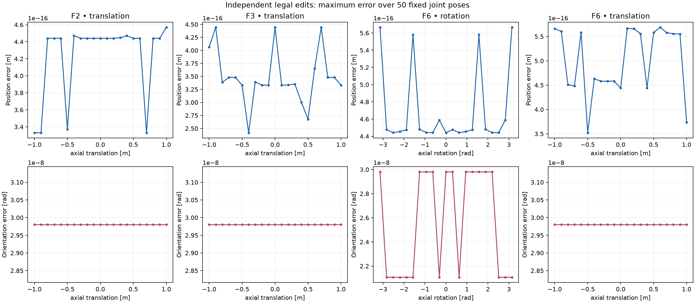
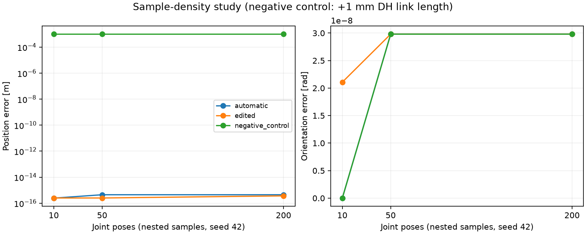

# Research record and measured contributions

This record consolidates committed experiments through Stage 19, reviewed in
Stage 20. It introduces no new experiment or measured performance claim.
[Architecture](architecture.md) defines the implemented contracts;
[reproduction instructions](reproducibility.md) specify commands and settings.
Historical results retain their original provenance instead of being relabeled
as runs of the latest documentation commit.

## Question, method and scope

Can a researcher change a serial robot's Standard-DH frame convention within
geometrically legal freedoms while preserving its URDF forward kinematics?
URDF2DT combines immutable automatic baselines, constrained frame edits with
adjacent/tool compensation, sequential acceptance, local checks and sampled global
validation. Its reference implementation includes a native editor, notebook and
CLI, with JSON-only persistence and reproducibility metadata.

This is an internal computational validation study of idealized kinematics.
It does not measure physical robot accuracy, evaluate a clinical/safety system,
or establish a new theorem or superiority over an external solver.

## FK metrics and sampling

For reference and candidate end-effector transforms, position error is
`||p_ref - p_candidate||_2` in metres. Orientation error is
`acos(clamp((trace(R_ref^T R_candidate)-1)/2, -1, 1))` in radians.
Reports retain maxima, means, worst-sample indices and per-sample errors.
A pass requires both maxima to be at or below their configured thresholds.
Zero-pose gauge-aligned prefix errors support diagnosis, but do not independently
determine the end-effector pass and cannot always localize constant offsets.

Default checks use 50 total poses, seed 42 and tolerances 1e-4 m / 1e-4 rad.
Zero is included first even when it lies outside a bounded joint's limits; the
report records that condition. Other poses use declared bounded limits, or
[-pi, pi] for continuous joints. Density studies use nested 10/50/200 samples.
The trace/acos metric has a floating-point floor near 1e-8 rad, so residuals of
that scale are numerical, not measured physical rotations.

## UR5 baseline and edited example

The [executed worked notebook](../examples/ur5_full_pipeline.ipynb) uses the bundled
six-revolute UR5 serial fixture. Its source SHA-256 is
`2dc91dafb13f23beadb867f81880db1de4baa963973e768521ab7abbc5314882`.
The walkthrough shifts F2 by 0.025 m, rejects and repeats its preview, accepts all
six frames, validates and exports. All 14 code cells ran in a fresh Python 3.12
kernel. The largest edited residuals were 4.441027621704298e-16 m and
2.9802322387695312e-8 rad over 50 poses; exact editor-state reload succeeded.
[Stage 19 evidence](../outputs/review/stage19_notebook.json) records the metrics.
This was a fresh kernel in the existing environment, not a clean installation.

## Ablation design and outcomes

The [bundled UR5 data](../outputs/research/stage14_bundled/results.json) and
[doctor UR5 data](../outputs/research/stage14_doctor/results.json) retain source
and selected-chain hashes, code fingerprints, versions, edits and sampled poses.
They are two input descriptions of matching tested UR5 kinematics, not two robot
architectures. Each was tested independently with the same controls.

| Experiment | Controlled change | Result for each UR5 description |
|---|---|---|
| Classification sensitivity | Parallel threshold 1e-6, 3e-6, 1e-5, 3e-5, 1e-4; other settings fixed | No case/coincidence/review changes |
| Legal edit sweep | 21 values per freedom; translations [-1,1] m, rotation [-pi,pi] | 84/84 local + sampled FK passes |
| Density | 10, 50, 200 poses for automatic and combined edited models | All six model/count combinations passed |
| Negative control | Add 0.001 m to F3 link length, bypassing acceptance only for the experiment | Failed at every density |
| Synthetic boundaries | Three threshold families, eight factors each | 24 recorded probes with transitions and review locks |

The four swept freedoms are F2/F3 translation and terminal F6 translation/rotation.
Every value starts a fresh session and traverses real acceptance gates; each
candidate uses 50 identical joint poses. Across the 84 points, maximum residuals
were **5.688200336284365e-16 m** and **2.9802322387695312e-8 rad** for each source.
The largest negative-control position error was approximately 0.001 m.

The threshold experiment reclassifies a fixed model; it is not a solver-generation
threshold ablation. Finite translation sweeps do not cover the unbounded legal
space, and discrete rotation samples do not prove every value or simultaneous
edit combination. Increasing sample density does not tighten tolerances.

## Structurally different robot

The original [RRPR SCARA fixture](../robots/scara/README.md) has four moving axes,
including a downward prismatic axis, antiparallel geometry, and nontrivial fixed
base/tool transforms. It exercises mixed metre/radian controls without modifying
the production solver. Edits translate all four frames by 0.025 m and rotate
F3/F4 by 0.2 rad with compensation.

Over 200 poses, the separate analytic calculation compared URDF, automatic DH
and edited DH transforms, giving a maximum matrix-element residual of
**7.771561172376096e-16**. Edited sampled FK maxima were
**3.5135752366389115e-16 m** and **3.6500241499888574e-8 rad**.
[The source verification](../outputs/generalization/stage15_scara/verification.json)
and [full archive](../outputs/generalization/stage15_scara/session/session.json)
retain evidence. The original script's pending human-observation field is
historical; the later [user self-report](stages/15_usability_observation.md)
records local launch and unaided frame acceptance. The participant knew the
project and received a launch command; this is not a novice usability study.

Native checks exercised four controls, a 0.18 m prismatic endpoint, six visual
actors, actor reuse and both themes. Those checks are separate from kinematic
accuracy and hosted headless CI. One idealized second architecture demonstrates
that this implementation is not limited to a six-revolute UR5, but does not
establish coverage of every serial mechanism.

## Regression and evidence map

| Evidence | What it supports |
|---|---|
| [Stage 16 invariants](stages/16_invariant_regressions.md) | Seeded edit/restore/rejection and geometry regression coverage |
| [Stage 18 review](stages/18_interface_review.md) | 314 local tests, type checks on 38 source files, interface fixes |
| [Stage 19 hosted run](https://github.com/Abdelrahman-288/URDF2DT/actions/runs/35103091993) | Successful regression matrix on Ubuntu 3.10/3.12 and Windows 3.12 for commit 6ea739f |
| [Stage 18 native record](../outputs/review/stage18_native.json) | Native UR5/SCARA smoke checks, distinct from CI |
| [Stage 19 notebook record](../outputs/review/stage19_notebook.json) | Complete fresh-kernel walkthrough and archive round trip |

Tests are finite regression evidence, not formal verification. The URDF and DH
production paths share some mathematical infrastructure; the independent SCARA
oracle improves independence for that fixture only. Reference MATLAB execution
and external solver agreement remain unverified.

## Contribution paragraph for a paper draft

URDF2DT implements a constraint-aware Standard-DH frame editor for serial robots,
combining an immutable automatic reference, compensated geometric frame edits,
sequential acceptance, and reproducible local and sampled FK checks. In internal
experiments on each of two UR5 input descriptions with matching tested kinematics,
all 84 sampled legal edits passed local checks and 50-pose FK validation, with
maximum residuals of 5.69e-16 m and 2.98e-8 rad; a deliberately injected 1 mm
link-length error failed at 10, 50 and 200 poses. Generalization to an idealized
four-axis RRPR SCARA required no production solver changes and achieved a maximum
matrix-element residual of 7.77e-16 against an independent analytic calculation
over 200 poses. These results support the tested implementation and sampled
configurations under provisional tolerances; they do not establish continuous-space
proof, physical accuracy, or external reference equivalence.

## Limitations and open acceptance items

- Report-specific R1–R3 labels and MATLAB/frame-convention comparisons await
  reconciliation; implemented conditions are documented by their actual names.
- Tolerances remain provisional. No advisor approval is inferred from passing CI.
- Only selected serial chains are solved; closed loops, whole-tree animation,
  floating/planar joints and mimic coupling are unsupported.
- Robot files without a recorded verification run are not evidence of generalization.
- CAD substitutions and collision decomposition are presentation features, not
  mesh-fidelity or collision-safety certification. Dynamics and simulation accuracy
  are outside the tested kinematic claims.
- Dependency ranges are not a frozen release environment. Archive numerical
  revalidation may differ across versions; code hashes and environment records
  should accompany attempted reproduction.
- No clean-machine standalone Windows executable has been validated yet.
  Release-candidate integration, handoff and distribution remain later stages.

See [failure modes and reproduction](reproducibility.md) before rerunning or
interpreting a failed result. This record preserves uncertainty rather than
turning planned acceptance criteria into completed findings.
