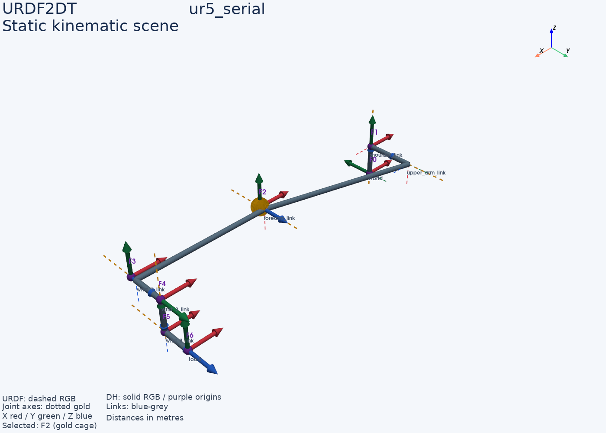

# Stage 6: Static 3-D scene renderer

Implemented in `urdf2dt/visualization/scene.py` with a command-line entry point
at `python -m urdf2dt.visualization`. The renderer shows simplified link tubes,
gold dotted movable-joint axes, dashed RGB URDF frames, solid RGB DH frames with
purple origins, and a gold cage around an optional selected DH frame.

## Geometry and ownership

`StaticScene(chain, model, q=None, selected_frame=None)` builds an immutable
snapshot. URDF frames include the base and every child, including fixed joints.
DH frames are F0 through Fn, including the solver's base alignment. `tool_frame`
separately retains the DH tip after tool alignment: Fn is not generally the tool.
The visible URDF tip supplies the tool location in the scene; the DH tool pose
is available for numerical comparison rather than an additional overlapping triad.

Joint axes pass through their moving child origins and rotate with the chain;
prismatic displacement moves the displayed segment along the same axis line.
Bones join successive URDF origins. Coincident origins do not create degenerate
tubes. All coordinates use the selected URDF base, in metres; q uses movable
joint order and radians/metres. Zero pose is permitted even outside joint limits,
consistent with the FK evaluators. Rendering is not a limit or FK certification.

The model and chain must match source digest, robot, ordered joints and joint
types. The scene does not modify models or own editor state. Frame selection is
only a visual highlight. Accepted/invalidated states and editing are later work.

## Python and notebook use

```python
from urdf2dt.pipeline import generate_automatic_model
from urdf2dt.visualization.scene import StaticScene

run = generate_automatic_model("robots/ur5/ur5_serial.urdf")
scene = StaticScene(run.chain, run.automatic_model, selected_frame="F2")
scene.render("outputs/scenes/ur5_zero_pose.png")
# For a notebook or a customized camera, own and close the plotter explicitly:
view = scene.plotter(labels=False)
try:
    view.show()
finally:
    view.close()
```

`plotter()` accepts `urdf`, `dh`, `axes`, `bones`, and `labels` visibility flags.
`render()` accepts the same flags and closes its plotter even on failure. PyVista
loads only on drawing; numerical scene data remain usable with core dependencies.
The optional graphics boundary uses dynamic imports and Any for third-party VTK
objects, while domain transforms and scene records remain typed.

## Verification

- Full test suite: 192 passed, including nine scene checks.
- Mypy: clean across 22 source files, retaining the Python 3.10 target.
- Verified UR5 shoulder origin `(0, 0, 0.089159)` and upper-arm origin
  `(0, 0.13585, 0.089159)`, plus tip origin and rotated joint geometry.
- Verified prismatic displacement, fixed-link inclusion, immutable q snapshots,
  separate tool alignment, invalid inputs and import without UI dependencies.
- Rendered UR5 zero pose offscreen at 1400 x 1000 and visually inspected it;
  also rendered the mixed-joint fixture at q `(0.4, 0.6, 0.3)`.



This is a kinematic skeleton, not mesh or collision geometry. Coincident frames
and nearby labels may overlap; use the layer flags or camera orbit to inspect
them. Rendering requires the optional UI dependencies and an available VTK
graphics backend. Project-specific MATLAB comparison remains pending its inputs.
