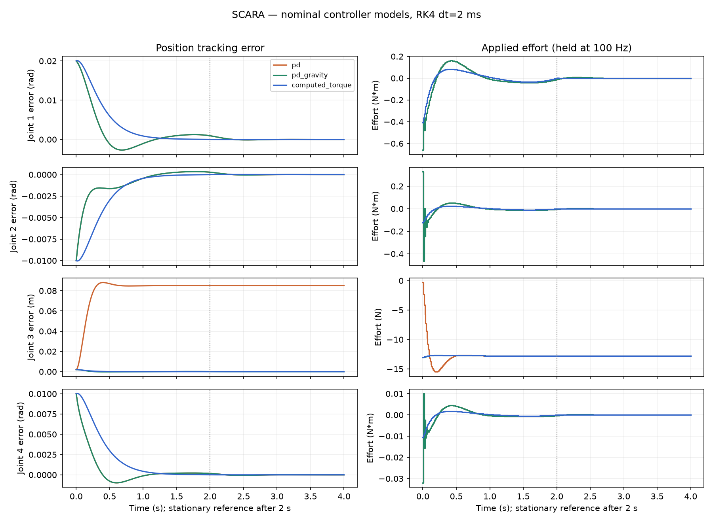
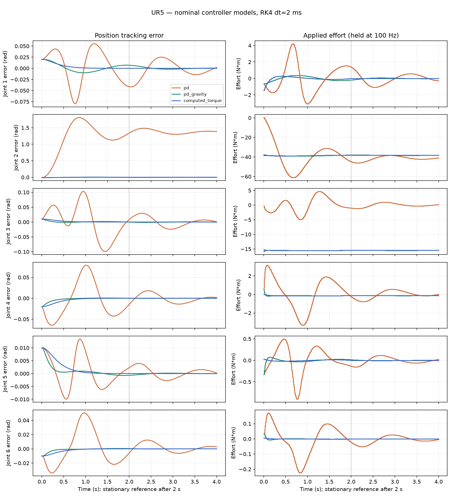

# Stage 28 — Simulation Environment

The project owner confirmed **Python RK4 with MuJoCo comparison**. The simulation
connects the Stage 24 dynamics, Stage 26 polynomial reference and Stage 27 sampled
controllers. It advances the plant under clipped, zero-order-held joint efforts.
The Python API also accepts source-matched Stage 25 identified controller models.

## Run locally

Use Python 3.12 in this stage's checkout:

```powershell
python -m pip install -e ".[dev,research,dynamics-reference]"
python -m urdf2dt.simulation scara --output outputs/simulation/scara-1 --plots
python -m urdf2dt.simulation ur5 --output outputs/simulation/ur5-1 --plots
```

Each command requires a new output directory, prints the assessment, and exits
nonzero when a study fails. The existing
`requirements/windows-py312-identification.lock` pins the tested environment.
The simulation is a headless Python workflow; the Stage 23 Windows executable
does not include these controls or a simulation playback UI.

## Experiment and criteria

`simulation/protocol.py` fixes the scenarios and engineering thresholds before
formal runs. Each output writes the checksummed `protocol.json` before simulation.
Both UR5 and SCARA use a two-second quintic move followed by a two-second stationary
hold, nonzero initial position/velocity errors and a 100 Hz controller. PD,
PD+gravity and computed torque each run with controller inertia scales 0.8, 1.0
and 1.2, while the nominal plant stays fixed. The scale multiplies masses and COM
inertia tensors, preserving physical consistency. Friction is zero in these
recorded nominal fixtures; the engine supports the model's explicit friction law.

Pilot runs revealed sampled-data oscillation in the illustrative Stage 27 wrist
PD gains. Wrist Kp/Kd are now UR5 3/0.6 and SCARA 3/0.4. SCARA computed-torque slide
gains are 100/20: the former 25/10 gave about 0.091/0.061 m RMSE under -/+20% model
mass bias, exceeding the declared 0.05 m sensitivity bound. This tuning pilot is
distinct from formal evaluation; the frozen protocol records the change. These
gains are engineering examples, not hardware tuning recommendations.

All cases require finite states, bounded effort, declared speed bounds and no
integration-boundary position-limit crossing. Strict tracking, steady-state and
settling criteria apply to nominal computed torque. Parameter-biased PD+gravity
and computed torque have separate bounded-error criteria. Uncompensated PD is a
reported baseline with expected gravity offset; passing its bounds does not mean
accurate tracking. No criteria are relaxed after formal results are collected.
Backend selection is confirmed; **formal advisor acceptance of the numerical
thresholds remains pending**.

## Numerical validation and assumptions

Classical explicit RK4 integrates q/v at 2 ms while each actuator command remains
constant for 10 ms. Intermediate RK4 stages reevaluate forward dynamics. Every
nominal controller is repeated at 1 ms and 0.5 ms, keeping the controller period
fixed. Both successive differences must meet the declared convergence bounds.
An analytical oscillator test separately demonstrates fourth-order convergence;
an analytical prismatic plant checks the exact sampled PD recurrence.

The independent reference uses MuJoCo forward dynamics inside the **same RK4
algorithm**, isolating dynamics disagreement. It does not claim two independent
integrators. Independent inverse dynamics also checks the primary logged
accelerations against applied effort. MuJoCo imports the nominal URDF inertias
through the validated Stage 24 adapter. This validates numerical consistency,
not accuracy relative to a physical robot.

The model assumes a fixed base, rigid serial links and ideal effort actuators.
There is no contact solver, collision response, joint-stop impulse, noise, delay
or real-time scheduling guarantee. Position limits are checked at integration
boundaries, not certified continuously between them. Crossing a limit or
encountering nonfinite state raises an error rather than clipping state.
Controller period must divide duration, and integration step must divide the
controller period. A maximum-step budget rejects excessive requested work.

## Output and metric definitions

Outputs preserve checksummed plant/reference archives, each bound controller
configuration, controller-rate q/v/a, reference states, raw/clipped effort,
saturation flags, initial conditions, model digests, timestep and versions.
`report.json` summarizes nine primary cases and three nominal-controller
comparisons. Additional trace files retain both refinements and the MuJoCo runs.
`nominal-tracking.png` displays position errors and applied efforts when requested.

Position/velocity RMSE and maximum error are per joint, retaining rad/m units.
Cartesian translation error is a Euclidean norm in metres; orientation error is
the SO(3) geodesic angle in radians. Steady-state signed mean error and RMSE use
the final one-second window. Settling is measured after the move ends, requires
all remaining samples inside each joint's band and at least one second of
observation; otherwise it is null. Overshoot is beyond the final reference in
the move direction; zero-displacement joints have null percentage. This is a
finite-horizon definition, not an asymptotic stability proof.

Effort RMS, peak, total variation and saturation duration exclude the final
zero-duration command. All metrics use complete uniform controller-rate logs.
Runtime is wall-clock initialization/control/integration/logging time, separate
from metric/export costs; it is not a real-time deadline guarantee.

The next stage is Stage 29 hardware validation, which needs a selected robot,
an actuator/encoder interface and actual laboratory access. It cannot be verified
with synthetic trajectories alone. The deferred clean-Windows Stage 23 test and
external research sign-off remain separate outstanding checks.

## Recorded evaluation — 2026-09-18

Both formal studies ran from clean source commit
`3d3086c12ee074843298e767cbe6667123ae489d`, after the protocol was committed.
Evidence: [SCARA report](../../outputs/validation_reports/stage28/scara/report.json)
and [UR5 report](../../outputs/validation_reports/stage28/ur5/report.json).
All 18 primary cases and all six nominal-controller comparison groups passed
their predeclared engineering checks. Each group includes two refinement pairs,
an independent forward-dynamics trajectory and inverse-effort consistency.

| Nominal computed-torque result | SCARA | UR5 |
|---|---:|---:|
| Cartesian position RMSE | 2.344 mm | 4.119 mm |
| Orientation RMSE | 0.005189 rad | 0.007310 rad |
| Largest rotary joint position RMSE | 0.005187 rad | 0.005189 rad |
| Prismatic position RMSE | 0.360 mm | N/A |
| Effort saturation fraction | 0 | 0 |
| Settling after move ends, all joints | 0 s | 0 s |

Zero post-move settling time means errors were already inside their declared bands
when the reference entered its hold at 2 s, and stayed there through 4 s. It does
not mean the initial errors disappeared instantly.

The largest rotary position difference across successive timestep halvings was
1.26e-13 rad for SCARA and 8.60e-11 rad for UR5. SCARA computed-torque refinement
is at floating-point roundoff; do not infer an order from that case. UR5 PD
differences decreased approximately 16-fold on halving the step, consistent with
the separate analytical fourth-order regression. The largest rotary position
difference between primary and MuJoCo dynamics was 1.27e-11 rad for SCARA and
6.66e-16 rad for UR5; SCARA's prismatic difference was zero in these runs.

Model mismatch remains visible: SCARA computed-torque slide RMSE rises to
23.731/15.734 mm with -/+20% inertia scaling; UR5's largest joint RMSE rises to
0.18535/0.13549 rad. Ordinary PD's uncompensated baseline has about 1.326 rad RMSE
on UR5 joint 2 and 83.258 mm on the SCARA slide. These are reported limitations,
not successful precision tracking. Good nominal behavior must not be generalized
to unknown hardware parameters.

The studies took approximately 101.8 s (SCARA) and 153.2 s (UR5), including
comparisons and output, while other verification also ran on the host. Reports
retain individual run timings, OS, processor, Python and dependency versions;
these wall-clock figures are not isolated performance benchmarks.

Local verification: **432 pytest tests passed**, mypy passed for **74 source
files**, and `pip check` found no broken requirements. Tests include analytical
integration, actuator hold/clipping, invalid grids/states, independent dynamics,
complete-log metric semantics and exact replay from persisted source/model/
trajectory/controller archives. Both generated tracking figures were inspected.




